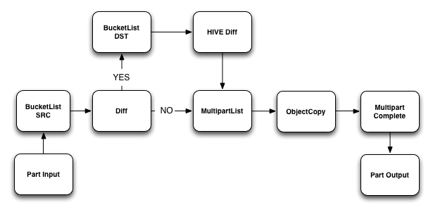
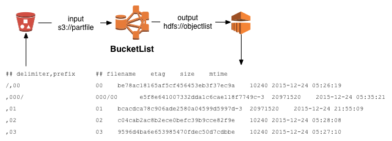
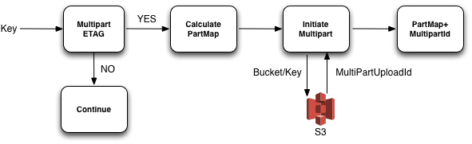
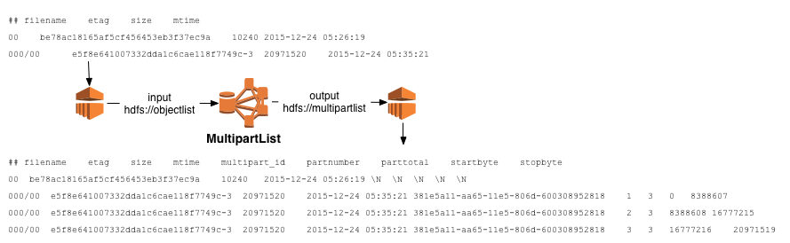
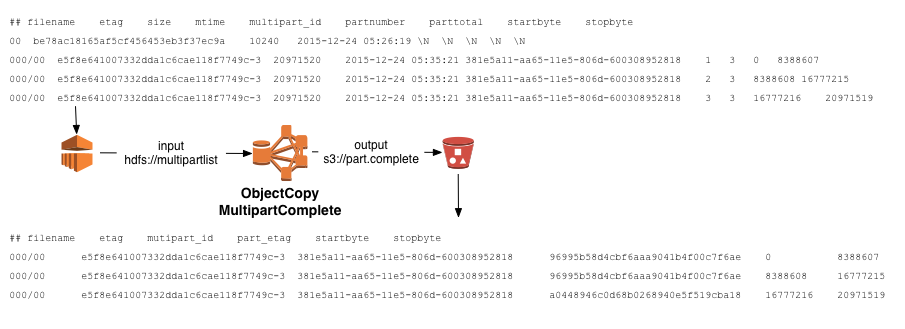

## Introduction 

Have you ever had to copy a huge Amazon S3 bucket to another account or region? Or create a list based on object name or size? How about mapping a function over millions of objects? [Amazon EMR](https://aws.amazon.com/elasticmapreduce/) to the rescue! EMR allows you to deploy large managed clusters, tightly coupled with S3, transforming the problem from a single, unscalable process/instance to one of orchestration. 

The Campanile framework is a collection of scripts and patterns that use standard building blocks like Hadoop MapReduce, Streaming, HIVE, and Python Boto. Customers have used Campanile to migrate petabytes of data from one account to another, run periodic sync jobs and large Amazon Glacier restores, enable SSE, create indexes, and sync data before enabling CRR. 

Traditionally, you could perform these tasks with simple shell commands: `aws s3 ls s3://bucket | awk '{ if($3 > 1024000) print $0 }'`. More recently, you could use complex threaded applications, having single processes make hundreds of requests a second. Now, with object counts reaching the billions, these patterns no longer realistically scale. For example, how long would it take you to list a billion objects with a process listing 1000 objects/sec? 11 days without interruption. 

This post examines how the Campanile framework can be used to implement a bucket copy at speeds in excess of 100 Gbps or tens of thousands of transactions per second. Campanile also helps streamline the deployment of EMR, by providing a number of bootstrap actions that install system dependencies like Boto, write instance-type specific configuration files, and provide additional useful development and reporting tools like SaltStack and Syslog. 

**NOTE:** There are a number of hard-coded parameters throughout the examples, which go against the API driven nature of AWS. This is a deliberate design optimization. When processing billions of objects, a single extra API request can quickly become a performance and cost inhibitor.

## Requirments 

All code samples and documentation be found [AWS BigData Blog Repo](https://github.com/awslabs/aws-big-data-blog). Step one is to download or clone the repo locically. Python modules dependencies can then be installed using pip, and the included [requirements](./etc/requirements.txt) file. 

    $ git clone https://github.com/awslabs/aws-big-data-blog.git
    $ cd aws-big-data-blog/aws-blog-campanile

    ## Use pip-2.7 if system has multiple versions of pip
    $ pip install -r ./etc/requirements.txt -U

## Streaming Overview 

Campanile Mapper and Reducer functions use [Hadoop Streaming](http://docs.aws.amazon.com/ElasticMapReduce/latest/ReleaseGuide/UseCase_Streaming.html) to operate entirely on [standard streams](https://en.wikipedia.org/wiki/Standard_streams), making it easy to integrate scripting languages like python. STDOUT is used for passing data between mappers, reducers, and HDFS/S3, while STDERR is used for control messaging (below you will fine two examples of this). Each streaming step creates a _sandboxed_ environment, setting environment variables and copying files (passed in with the -files option) into a temporary location. Campanile provides a number of functions and patterns to help support the Hadoop Streaming sandbox.  

### Counters 

Mappers can use the following format to create global counter(s).
 
    reporter:counter:<group>,<counter>,<amount>

For example, BucketList uses this function to count the size of all objects in bytes 

    ## campanile.py
    def counter(group, counter, amount):
        stderr.write("reporter:counter:%s,%s,%s\n" % (group, counter, amount))

    ## bucketlist.py 
    campanile.counter(args.bucket, "Bytes", key.size)

    ## See step syslog on master node for counter output(s)
    $ ssh hadoop@<master-public-hostname> "tail /var/log/hadoop/steps/<step-id>/syslog"
            Physical memory (bytes) snapshot=4647555072
            Virtual memory (bytes) snapshot=31281672192
            Total committed heap usage (bytes)=5704253440
        <args.bucket>
            Bytes=55045264
        File Input Format Counters 
            Bytes Read=482
        File Output Format Counters 
            Bytes Written=16144
    2016-01-07 22:39:01,902 INFO org.apache.hadoop.streaming.StreamJob (main): Output directory: /1452206272/<args.bucket>.list
  
### Status Messages

A task will be terminated if it does not get input, write an output, or receive a status string within a configurable amount of time. The following format can be used to message status to the task manager. 

    reporter:status:<message>

GETing or PUTing a large objects can easily exceed default timeouts. Using boto's canned get and set *contents_from_file* functions, one can use the callback function to report a periodic status. 

    ## campanile.py
    class FileProgress:
	    def __init__(self, name, verbose=0):
	        self.fp = 0
	        self.total = None
	        self.verbose = verbose
	        self.name = name

	    def progress(self, fp, total):
	        self.total = total
	        self.fp = fp
	        if self.verbose == 1:
	            stderr.write("reporter:status:%s:%s out of %s complete\n" % \
	                    (self.name, fp, total))

    ## objectcopy.py
    p = campanile.FileProgress(report_name, verbose=1)
    srckey.get_contents_to_file(fp, headers=headers,
        version_id=version_id, cb=p.progress)

### Sandbox

While shared libraries and configuration files are a perfect use case for [bootstrap actions](http://docs.aws.amazon.com/ElasticMapReduce/latest/ManagementGuide/emr-plan-bootstrap.html), during development it can be much easier to update functions on each invocation. Streaming steps use the `-files` option, to load files from S3/HDFS into the sandbox environment. In the mapper code, you see the _sandbox_ is added to *PATH*, and the local directory is added as a configuration file search path.

    ## Support for Streaming sandbox env
    sys.path.append(os.environ.get('PWD'))
    os.environ["BOTO_PATH"] = '/etc/boto.cfg:~/.boto:./.boto'
    import campanile
    import boto

    ... 

    parser.add_argument('--config', '-c', default="./campanile.cfg",
            help='Path to config file')
    ...

    cfgfiles = campanile.cfg_file_locations()
    cfgfiles.insert(0, args.config)
    c = ConfigParser.SafeConfigParser()
    c.read(cfgfiles)

### Input Split 

Campanile relies heavily on the [NLineInputFormat](https://hadoop.apache.org/docs/r2.4.1/api/org/apache/hadoop/mapred/lib/NLineInputFormat.html) property, which controls how many lines of input are sent to each mapper task. For example, an objectcopy step is only successful if **ALL** objects passed to it are copied successfully. Therefore, limiting the number of objects for a single process can drastically increase probability of success. To support this _"split"_, while also allowing campanile to function in a normal shell, one needs a _"Streaming Environment"_ check. 

**NOTE:** Another extremely important property of this function, is how often a S3 connection object is re-established. At the end of the split, another process, and therefore a new connection to S3 is made. S3 has hundreds, if not thousands of endpoints, and the only way to achieve distribution is to utilize the entire fleet. (Get link to article detailing this)

    ## campanile.py provides and index function
    ## Note reducers don't get an index
    def stream_index():
        try:
            if os.environ['mapred_input_format_class'] == \
                'org.apache.hadoop.mapred.lib.NLineInputFormat' and \
                os.environ['mapreduce_task_ismap'] == "true":
                return 1
        except:
            pass
        return 0

    
    ## objectcopy.py
    start_index = campanile.stream_index()
    for line in fileinput.input("-"):
        record = line.rstrip('\n').split('\t')[start_index:]
   

### MapReduce Configuration(s)

While MapReduce options can be set for an [entire cluster](http://docs.aws.amazon.com/ElasticMapReduce/latest/API/EmrConfigurations.html), it is useful to fine tune them on a step by step basis. Referencing the [rsync.py](./bin/rsync.py) EMR wrapper, the table below offers some insight into why certain values were set for specific tasks. Depending on the _emr-release-label_, check hadoop version and see all configuration options here: `https://hadoop.apache.org/docs/r<hadoop-version>/hadoop-mapreduce-client/hadoop-mapreduce-client-core/mapred-default.xml` 

Name | Description
--- | --- 
mapreduce.map.maxattempts | While the default value is fine (4 in Hadoop 2.6.0), it's a good option to have for those problematic mappers. 
mapreduce.task.timeout | The number of milliseconds before a task will be terminated if it neither reads an input, writes an output, nor updates its status string. For steps like _BucketList_, or _MultipartList_, where one expects rapid output, this value can be small. _ObjectCopy_, where a mapper's copy throughput can be slow, larger values are needed. 
mapreduce.map.speculative | Set to **false** for all Campanile steps. Copying the same object at the same time, can be problematic. 
mapreduce.input.lineinputformat.linespermap | Discussed above, this defined how much of the Input each mapper process will see. For _BucketList_, that can be long running, this value should generally be 1. For _MultiPartList_, which is a single [HeadObject](http://docs.aws.amazon.com/AmazonS3/latest/API/RESTObjectHEAD.html) and [UploadInitiate](http://docs.aws.amazon.com/AmazonS3/latest/API/mpUploadInitiate.html) for objects uploaded via _multipart_, chances of failure are very low, and therefore can be much higher the _BucketList_. 
org.apache.hadoop.mapred.lib.NLineInputFormat | Set as input format when using _mapreduce.input.lineinputformat.linespermap_
mapreduce.job.reduces | Only set in the _ObjectCopy_ step, because it's the only step that requires a reducer. It also controls the number of output files written (1 per reducer). In this example, where a single output file is easier to manage, this is set to 1. (This can have an ill effect on reliability of the job to finish successfully, but reducer failures are rare in this case)
mapreduce.output.fileoutputformat.compress | Text is highly compressible, so this is generally set to true
mapreduce.output.fileoutputformat.compress.codec | org.apache.hadoop.io.compress.GzipCodec is always a good choice. Output is not in .gz format, and can be un-ziped with gzip utilities. 

## Setup

All code and CloudFormation examples can be found in the [aws-blog git repo](https://github.com/awslabs/aws-big-data-blog), and should be cloned locally. The following definitions will be reference throughout the article.

Name | Description
--- | --- 
account1 | Source AWS account owner
account2 | Destination AWS account owner   
srcbucket | Bucket containing source data, owned by account1
codebucket | Bucket containing source code, also owned by account1
dstbucket | Bucket owned by account2
jeff | Boto profile of IAM User of source account
jassy | Boto profile of IAM User of destination account

To simply command line examples, set the following env variables. All actions will take place in AWS_DEFAULT_REGION. An empty source file has been provided [here](./etc/blog-cmds). Update accordingly and `source ./etc/blog-cmds`. 

	## Set default region
	export AWS_DEFAULT_REGION=us-west-2

	##  Admin profiles
    $ ADMIN_ACCOUNT1=account1 
    $ ADMIN_ACCOUNT2=account2

    ## Buckets created below
    $ SRC_BUCKET=srcbucket
    $ DST_BUCKET=dstbucket
    $ CODE_BUCKET=codebucket

    ## Region of buckets created below 
    $ SRC_ENDPOINT=s3-us-west-2.amazonaws.com
    $ DST_ENDPOINT=s3-us-west-2.amazonaws.com

    ## Source and destination profiles created in section IAM Users
    $ SRC_PROFILE=jeff
    $ DST_PROFILE=jassy

**NOTE:** You can remove all `--profile $ADMIN_ACCOUNT1`, if the ADMIN_ACCOUNT1 is actually the default credentials. 

### S3 Buckets 

This process requires three buckets. A source, destination, and a third bucket that contains code, configuration, and input/output files. If one does not have access to multiple AWS accounts, one can just create a destination bucket in the source account. Step 1 is to create these buckets.  

	## Create test buckets 
	## Assumes profiles are available in ~/.aws/credentials
    $ aws s3 mb $SRC_BUCKET --profile $ADMIN_ACCOUNT1
    $ aws s3 mb $CODE_BUCKET --profile $ADMIN_ACCOUNT1
    $ aws s3 mb $DST_BUCKET --profile $ADMIN_ACCOUNT2

**NOTE:** The _codebucket_ should be in the same region and account as the _srcbucket_.   

### Test Files

Untar and copy testfiles into source bucket. 

    $ cd aws-big-data-blog/aws-blog-campanile 
    $ tar -C /tmp -xzf ./var/testfiles.tgz
    $ aws s3 sync /tmp/testfiles s3://$SRC_BUCKET --profile $ADMIN_ACCOUNT1
    
    ## List test objects using aws cli 
    $ aws s3api list-objects --bucket $SRC_BUCKET --query 'Contents[*].[Key,ETag,Size,LastModified]' --output text --profile $ADMIN_ACCOUNT1
    00	"be78ac18165af5cf456453eb3f37ec9a"	10240	2015-12-22T22:02:04.000Z
	000/00	"e5f8e641007332dda1c6cae118f7749c-3"	20971520	2015-12-22T22:02:04.000Z
	01	"bcacdca78c906ade2580a04599d5997d-3"	20971520	2015-12-22T22:04:13.000Z
	02	"c04cab2ac8b2ece0befc39b9cce82f9e"	10240	2015-12-22T22:04:14.000Z
	03	"9596d4ba6e653985470fdec50d7cdbbe"	10240	2015-12-22T22:04:14.000Z
	04	"572a28822adc99c0250b1479ac974b92"	10240	2015-12-22T22:04:14.000Z
	....

**NOTE:** Object 00 000/00 was included to provide an example of why a delimiters are important.  

### IAM Users 

The CloudFormation template [s3_migration_user](cloudformation/s3_migration_user.json) creates IAM users necessary for the migration, and follows best practice [least privileged access](http://docs.aws.amazon.com/IAM/latest/UserGuide/best-practices.html#grant-least-privilege). One might ask, why not use the EMR instance role that has access to `s3:*`? Concurrent running mapper tasks quickly overload the local http server, causing permissions errors when the SDK attempts to get_temp_keys. Therefore, Campanile has mapper and reduce tasks use a local .boto file loaded into sandbox environment. See creation of this file below.

**NOTE:** Streaming Steps Input, Output, and -files directives, still rely on instance roles.

    $ cd aws-big-data-blog/aws-blog-campanile/cloudformation 

    ## Create Source ReadOnly User 
    $ aws cloudformation create-stack --stack-name s3-read-test --template-body file://s3_migration_user.json --parameters ParameterKey=Bucket,ParameterValue=$SRC_BUCKET ParameterKey=Operation,ParameterValue=Read --capabilities CAPABILITY_IAM --profile $ADMIN_ACCOUNT1

    ## Upon completion, get key creation command
    $ aws cloudformation describe-stacks --stack-name s3-read-test --query 'Stacks[].Outputs[?OutputKey==`UserKeyCreateCmd`].OutputValue[]' --output text --profile $ADMIN_ACCOUNT1

    ## Update [profile <name>] accordingly
    $ aws iam create-access-key --user-name s3-read-test-User-1VDS5E5QRC4E3 --query '{aws_access_key_id:AccessKey.AccessKeyId,aws_secret_access_key:AccessKey.SecretAccessKey}' --output text --profile $ADMIN_ACCOUNT1 | awk '{print "[profile jeff]\naws_access_key_id="$1"\naws_secret_access_key="$2"\n"}' >> .boto

    ## Create Write User
    $ aws cloudformation create-stack --stack-name s3-write-test --template-body file://s3_migration_user.json --parameters ParameterKey=Bucket,ParameterValue=$DST_BUCKET ParameterKey=Operation,ParameterValue=Write --capabilities CAPABILITY_IAM --profile $ADMIN_ACCOUNT2
    
    $ aws cloudformation describe-stacks --stack-name s3-write-test --query 'Stacks[].Outputs[?OutputKey==`UserKeyCreateCmd`].OutputValue[]' --output text --profile $ADMIN_ACCOUNT2
    
    ## Update [profile <name>] accordingly
    $ aws iam create-access-key --user-name s3-write-test-User-1G7JRF0PYYA5T --query '{aws_access_key_id:AccessKey.AccessKeyId,aws_secret_access_key:AccessKey.SecretAccessKey}' --output text --profile $ADMIN_ACCOUNT2 | awk '{print "[profile jassy]\naws_access_key_id="$1"\naws_secret_access_key="$2"\n"}' >> .boto

    ## See boto file 
	$ cat .boto 
	[profile jeff]
	aws_access_key_id=<access_key>
	aws_secret_access_key=<secret_key>

	[profile jassy]
	aws_access_key_id=<access_key>
	aws_secret_access_key=<secret_key>

	## Move .boto file into bin directory for testing
	$ mv .boto ../bin

### Bucket Part File

A _PartFile_ in delimiter,prefix format, describes the S3 bucket layout with no overlap. An example file has been provided [here](var/input/srcbucket/part.all), that maps to the set of testfiles. In this case, only *16* object maps to each `<delimeter>,<prefix>` entry, but in the real world it could be millions per line. One could also image splitting the part file up further, part.000, part.001, etc..., and processing across multiple clusters concurrently. 

The testfile 000/00 was included to clarify why delimiters are useful. Using the _s3api_, lets go over an example. 

	$ aws s3api list-objects --prefix 00 --bucket $SRC_BUCKET --profile $SRC_PROFILE --query 'Contents[*].[Key,ETag,Size,LastModified]' --output text
	00	"be78ac18165af5cf456453eb3f37ec9a"	10240	2015-12-24T05:26:19.000Z
	000/00	"e5f8e641007332dda1c6cae118f7749c-3"	20971520	2015-12-24T05:35:21.000Z

	## How could break this into two list calls?

	## List 00* in the root, using delimiter 
	$ aws s3api list-objects --delimiter / --prefix 00 --bucket $SRC_BUCKET --profile $SRC_PROFILE --query 'Contents[*].[Key,ETag,Size,LastModified]' --output text
	00	"be78ac18165af5cf456453eb3f37ec9a"	10240	2015-12-24T05:26:19.000Z

	## List 000/*
	aws s3api list-objects --prefix 000/ --bucket $SRC_BUCKET --profile $SRC_PROFILE --query 'Contents[*].[Key,ETag,Size,LastModified]' --output text
	000/00	"e5f8e641007332dda1c6cae118f7749c-3"	20971520	2015-12-24T05:35:21.000Z

### Source Files

Finally, it is time to copy all files into the code bucket! 

	## Change dir into blog root
	$ cd aws-big-data-blog/aws-blog-campanile

	## Upload bootstrap actions 
	$ aws s3 sync bootstrap s3://$CODE_BUCKET/bootstrap --profile $ADMIN_ACCOUNT1
	upload: bootstrap/campanile.sh to s3://codebucket/bootstrap/campanile.sh
	upload: bootstrap/syslog-setup.sh to s3://ccodebucket/bootstrap/syslog-setup.sh
	upload: bootstrap/salt-setup.sh to s3://codebucket/bootstrap/salt-setup.sh

	## Upload mappers and reducer
	$ aws s3 sync --exclude "*.cfg" --exclude "*.pyc" --exclude "rsync.py" bin s3://$CODE_BUCKET/ --profile $ADMIN_ACCOUNT1
	upload: bin/.boto to s3://codebucket/.boto
	upload: bin/bucketlist.py to s3://codebucket/bucketlist.py
	upload: bin/multipartlist.py to s3://codebucket/multipartlist.py
	upload: bin/multipartcomplete.py to s3://codebucket/multipartcomplete.py
	upload: bin/campanile.py to s3://codebucket/campanile.py
	upload: bin/objectcopy.py to s3://codebucket/objectcopy.py

	## Upload HIVE file
	aws s3 cp hive/diff.q s3://$CODE_BUCKET --profile $ADMIN_ACCOUNT1
	upload: ../hive/diff.q to s3://codebucket/diff.q

    ## Upload Partfile 
    $ aws s3 cp var/input/srcbucket/part.all s3://$CODE_BUCKET/input/$SRC_BUCKET/ --profile $ADMIN_ACCOUNT1
    upload: var/input/srcbucket/part.all to s3://codebucket/input/srcbucket/part.all

## Steps 

To determine the correct S3 endpoint, refer to [http://docs.aws.amazon.com/general/latest/gr/rande.html#s3_region](). The following tests are executed locally, and use PIPEs to simulate streaming IO. Once commands are verified, we can launch in EMR. 

**NOTE:** Send _stderr_ to _/dev/null_ to hide status messages: i.e. `2>/dev/null`

### BucketList 

The first step is a distributed list, which is only possible because of S3's lexicographically property, and the ability to [list keys hierarchically](http://docs.aws.amazon.com/AmazonS3/latest/dev/ListingKeysHierarchy.html). A part file is piped into _bucketlist.py_, which sets prefix and delimiter parameters, and calls [ListObjects](http://docs.aws.amazon.com/AmazonS3/latest/API/RESTBucketGET.html).   

    ## Control message counters are prefixed with reporter:counter: 
    $ head -n 1 ../var/input/srcbucket/part.all | ./bucketlist.py --bucket $SRC_BUCKET --endpoint $SRC_ENDPOINT --profile $SRC_PROFILE
    00	be78ac18165af5cf456453eb3f37ec9a	10240	2015-12-24 05:26:19
	reporter:counter:srcbucket,Bytes,10240
	...

### Hive Diff

In some occasions, it is useful to diff two buckets before starting a copy. This will require running a bucketlist on the destination, along with the source, and using the following [HIVE query](hive/diff.q). The output will become the new input to _multipartlist_. 

    DROP TABLE IF EXISTS src;
	DROP TABLE IF EXISTS dst;
	DROP TABLE IF EXISTS diff;
	CREATE EXTERNAL TABLE src(key STRING, etag STRING, size BIGINT, mtime STRING) ROW FORMAT DELIMITED FIELDS TERMINATED BY '\t' LINES TERMINATED BY '\n' LOCATION '${SRC}';
	CREATE EXTERNAL TABLE dst(key STRING, etag STRING, size BIGINT, mtime STRING) ROW FORMAT DELIMITED FIELDS TERMINATED BY '\t' LINES TERMINATED BY '\n' LOCATION '${DST}';
	CREATE EXTERNAL TABLE diff(key STRING, etag STRING, size BIGINT, mtime STRING) ROW FORMAT DELIMITED FIELDS TERMINATED BY '\t' LINES TERMINATED BY '\n' LOCATION '${DIFF}';
	INSERT OVERWRITE TABLE diff SELECT src.key,src.etag,src.size,src.mtime FROM src LEFT OUTER JOIN dst ON (src.key = dst.key) WHERE (dst.key IS NULL) OR (src.etag != dst.etag);

### MultipartList

MultiPartList corresponds to the API request [UploadInitiate](http://docs.aws.amazon.com/AmazonS3/latest/API/mpUploadInitiate.html). It's most difficult task is calculating part maps of source objects, that were uploaded with _multipart_. Review the details of multipart uploads [here](http://docs.aws.amazon.com/AmazonS3/latest/dev/mpuoverview.html), and understand how etags are calculated based on part size(s). In these examples, Campanile uses a function similar to that of the AWS CLI to calculate part size. Since this article assumes the test files were uploaded using the aws cli, multipartlist will be able to determine the correct partsize. 

**NOTE:** The only way to copy an object and keep the same etag, is to know the partsize(s) of the source upload. 

**NOTE:** Because _UploadInitiate_ happens here, this is where one can modify metadata, enable SSE, and/or make other changes to the new object. 

    ## campanile.py
    def cli_chunksize(size, current_chunksize=DEFAULTS['multipart_chunksize']):
	    chunksize = current_chunksize
	    num_parts = int(math.ceil(size / float(chunksize)))
	    while num_parts > MAX_PARTS:
	        chunksize *= 2
	        num_parts = int(math.ceil(size / float(chunksize)))
	    if chunksize > MAX_SINGLE_UPLOAD_SIZE:
	        return MAX_SINGLE_UPLOAD_SIZE
	    else:
	        return chunksize

	## multipartlist.py
    partsize = campanile.cli_chunksize(int(size))
    if partcount != int(math.ceil(float(size)/partsize)):
    	campanile.status("Can't calculate partsize for %s/%s" %
        		(args.src, name))
        ## Send an alert?
        continue

    ## For testing purposes, use the --dry-run option. 
    ## This example only lists a files that start with 00
	$ echo ',00' | ./bucketlist.py --bucket $SRC_BUCKET --endpoint $SRC_ENDPOINT --profile $SRC_PROFILE | ./multipartlist.py --src-bucket $SRC_BUCKET --src-endpoint $SRC_ENDPOINT --src-profile $SRC_PROFILE --dst-bucket $DST_BUCKET --dst-endpoint $DST_ENDPOINT --dst-profile $DST_PROFILE --dry-run
	reporter:counter:srcbucket,Bytes,10240
	reporter:counter:srcbucket,Bytes,20971520
	00	be78ac18165af5cf456453eb3f37ec9a	10240	2015-12-24 05:26:19	\N	\N	\N	\N	\N
	000/00	e5f8e641007332dda1c6cae118f7749c-3	20971520	2015-12-24 05:35:21	381e5a11-aa65-11e5-806d-600308952818	1	3	0	8388607
	000/00	e5f8e641007332dda1c6cae118f7749c-3	20971520	2015-12-24 05:35:21	381e5a11-aa65-11e5-806d-600308952818	2	3	8388608	16777215
	000/00	e5f8e641007332dda1c6cae118f7749c-3	20971520	2015-12-24 05:35:21	381e5a11-aa65-11e5-806d-600308952818	3	3	16777216	20971519

From the output, you see that the 20M object 000/00 has been broken into 3 parts. 

**NOTE:** _NULL_ or _None_ is represented as _\N_ for better HIVE integration

### ObjectCopy 

Corresponding to S3 APIs [GET](http://docs.aws.amazon.com/AmazonS3/latest/API/RESTObjectGET.html) and [PUT](http://docs.aws.amazon.com/AmazonS3/latest/API/RESTObjectPUT.html), _objectcopy.py_ does most of the work. It requires two _instance type_ parameters, set by Campanile's bootstrap action. To distribute load across disks, the ephemeral parameter is a list of all mount points, and then one is randomly selected for location of the downloaded object. But in many cases, a downloaded object/part will never reach disk. The second setting _maxtmpsize_, which is dependant on the instance's memory size, tells the _tempfile_ class to flush bytes to disk only when this size is reached. 

    ## For m2.xlarge
    $ head -n3 /etc/capanile.cfg 
	[DEFAULT]
	maxtmpsize=134217728
	ephemeral=/mnt,/mnt1

    ## objectcopy.py
    tmpdir = random.choice(c.get('DEFAULT',"ephemeral").split(','))
    with tempfile.SpooledTemporaryFile(max_size=c.getint('DEFAULT','maxtmpsize'),dir=tmpdir) as fp:
    	....

    ## See objectcopy example in MultipartComplete

For non-multipart objects, this is the step where one can modify metadata, enable SSE, and/or make other changes to the new object. It outputs part information about multipart uploads only, so the reducer can sort and complete the upload.   
 

### MultipartComplete 

The only reducer of the bunch, is responsible for sorting parts, and issuing the [MultiPartComplete](http://docs.aws.amazon.com/AmazonS3/latest/API/mpUploadComplete.html) command. The command below copies the first 2 objects in the source bucket.  

    $ echo ',00' | ./bucketlist.py --bucket $SRC_BUCKET --endpoint $SRC_ENDPOINT --profile $SRC_PROFILE | ./multipartlist.py --src-bucket $SRC_BUCKET --src-endpoint $SRC_ENDPOINT --src-profile $SRC_PROFILE --dst-bucket $DST_BUCKET --dst-endpoint $DST_ENDPOINT --dst-profile $DST_PROFILE | ./objectcopy.py --src-bucket $SRC_BUCKET --src-endpoint $SRC_ENDPOINT --src-profile $SRC_PROFILE --dst-bucket $DST_BUCKET --dst-endpoint $DST_ENDPOINT --dst-profile $DST_PROFILE | ./multipartcomplete.py --bucket $DST_BUCKET --endpoint $DST_ENDPOINT --profile $DST_PROFILE
    ...
    dstbucket/000/00	e5f8e641007332dda1c6cae118f7749c-3	7TiS9GhL59.Ej19ACMh.HDIvu4bbTvnsQNbA.mo4GfiR4vGjiZ2u7RvhTxLokXSBf3c5xREkFHorhgz9E6jluQ.B3msqQSyoKh3Ynar8QlMW8EmbosIf0oWgIRvTmr.J	96995b58d4cbf6aaa9041b4f00c7f6ae	1	0	8388607
	dstbucket/000/00	e5f8e641007332dda1c6cae118f7749c-3	7TiS9GhL59.Ej19ACMh.HDIvu4bbTvnsQNbA.mo4GfiR4vGjiZ2u7RvhTxLokXSBf3c5xREkFHorhgz9E6jluQ.B3msqQSyoKh3Ynar8QlMW8EmbosIf0oWgIRvTmr.J	96995b58d4cbf6aaa9041b4f00c7f6ae	2	8388608	16777215
	dstbucket/000/00	e5f8e641007332dda1c6cae118f7749c-3	7TiS9GhL59.Ej19ACMh.HDIvu4bbTvnsQNbA.mo4GfiR4vGjiZ2u7RvhTxLokXSBf3c5xREkFHorhgz9E6jluQ.B3msqQSyoKh3Ynar8QlMW8EmbosIf0oWgIRvTmr.J	a0448946c0d68b0268940e5f519cba18	3	16777216	20971519

	## Compare source and destination objects
	$ echo ',00' | ./bucketlist.py --bucket $SRC_BUCKET --endpoint $SRC_ENDPOINT --profile $SRC_PROFILE 2>/dev/null
	00	be78ac18165af5cf456453eb3f37ec9a	10240	2015-12-24 05:26:19
	000/00	e5f8e641007332dda1c6cae118f7749c-3	20971520	2015-12-24 05:35:21
	$ echo ',00' | ./bucketlist.py --bucket $DST_BUCKET --endpoint $DST_ENDPOINT --profile $DST_PROFILE 2>/dev/null
	00	be78ac18165af5cf456453eb3f37ec9a	10240	2015-12-24 17:55:07
	000/00	e5f8e641007332dda1c6cae118f7749c-3	20971520	2015-12-24 17:55:06

## Running the Code in EMR

### Launch EMR

This command launches a cluster, using default EMR Roles, Subnets, and Security Groups. Make sure to launch a cluster into the region as the _srcbucket_. 

**NOTE:** _MultipartComplete_ writes a compressed part-map of every copied multipart object to Hadoop's _output_ location. If this location resides in an S3 bucket that requires SSE, one must add `--emrfs Encryption=ServerSide` to the emr launch command. 

	## Update <keyname> accordingly
	$ aws emr create-cluster --release-label emr-4.2.0 --name S3ProcessingEngine --tags Name=Campanile --ec2-attributes KeyName=<keyname> --instance-groups InstanceGroupType=MASTER,InstanceCount=1,InstanceType=m3.2xlarge InstanceGroupType=CORE,InstanceCount=3,InstanceType=m3.xlarge --use-default-roles --enable-debugging --applications Name=HIVE --bootstrap-actions Path=s3://$CODE_BUCKET/bootstrap/campanile.sh,Name=campanile --log-uri s3://$CODE_BUCKET/log/jobflow/ --emrfs Encryption=ServerSide
    {
    	"ClusterId": "j-21Z837CG1ZQ14"
	}

	## Set JobId in shell (for commands below)
	$ JOBID=j-21Z837CG1ZQ14

	## Get cluster's master public hostname
	$ aws emr describe-cluster --cluster-id $JOBID --query 'Cluster.MasterPublicDnsName' --output text

	## In a separate terminal, SSH into master node
	$ ssh hadoop@ec2-54-218-146-30.us-west-2.compute.amazonaws.com
	...
	[hadoop@ip-10-46-4-20 ~]$ 

### Rsync

Within the repo, a command line _emr-add-step_ wrapper is provided. [Rsync.py](bin/rsync.py) will help set options, determine endpoints, and run jobs (Options are detailed using the -h command). Upon execution, it will assign an uuid, and print out _RunDir_ and _Output_ locations. _RunDir_ is a directory on HDFS that contains the input/outputs the intermittent steps. 

#### DryRun

Will print out steps, without executing them on the cluster. 

	## JOBID set above 
    $ ./rsync.py -j $JOBID --input s3://${CODE_BUCKET}/input/${SRC_BUCKET}/part.all --output s3://${CODE_BUCKET}/output/$SRC_BUCKET --code s3://$CODE_BUCKET --src-bucket $SRC_BUCKET --dst-bucket $DST_BUCKET --src-profile jeff --dst-profile jassy --dry-run
    RunDir: hdfs:///1451507458
	Output:s3://codebucket/output/srcbucket/part.all.1451507458
	{   '_jar': 'command-runner.jar',
    'action_on_failure': 'CANCEL_AND_WAIT',
    'cache_archives': None,
    'cache_files': None,
    'combiner': None,
    'input': 's3://codebucket/input/srcbucket/part.all',
    'mapper': 'bucketlist.py --bucket srcbucket --endpoint s3-us-west-2.amazonaws.com --profile jeff',
    'name': 'list.srcbucket.part.all',
    'output': '/1451507458/srcbucket.list',
    'reducer': None,
    'step_args': [   'hadoop-streaming',
                     '-files',
                     's3://codebucket/campanile.py,s3://codebucket/bucketlist.py,s3://codebucket/multipartlist.py,s3://codebucket/objectcopy.py,s3://codebucket/multipartcomplete.py,s3://codebucket/.boto',
                     '-D',
                     'mapreduce.map.maxattempts=4',
                     '-D',
                     'mapreduce.input.lineinputformat.linespermap=1',
                     '-D',
                     'mapreduce.map.speculative=false',
                     '-D',
                     'mapreduce.task.timeout=300000',
                     '-inputformat',
                     'org.apache.hadoop.mapred.lib.NLineInputFormat']}
	{   '_jar': 'command-runner.jar',
    'action_on_failure': 'CANCEL_AND_WAIT',
    'cache_archives': None,
    'cache_files': None,
    'combiner': None,
    'input': '/1451507458/srcbucket.list',
    'mapper': 'multipartlist.py --src-bucket srcbucket --src-endpoint s3-us-west-2.amazonaws.com --dst-bucket dstbucket --dst-endpoint s3-us-west-2.amazonaws.com --src-profile jeff --dst-profile jassy',
    'name': 'mlist.srcbucket.part.all',
    'output': '/1451507458/srcbucket.multipartlist',
    'reducer': None,
    'step_args': [   'hadoop-streaming',
                     '-files',
                     's3://codebucket/campanile.py,s3://codebucket/bucketlist.py,s3://codebucket/multipartlist.py,s3://codebucket/objectcopy.py,s3://codebucket/multipartcomplete.py,s3://codebucket/.boto',
                     '-D',
                     'mapreduce.map.maxattempts=4',
                     '-D',
                     'mapreduce.input.lineinputformat.linespermap=1000',
                     '-D',
                     'mapreduce.map.speculative=false',
                     '-D',
                     'mapreduce.task.timeout=300000',
                     '-inputformat',
                     'org.apache.hadoop.mapred.lib.NLineInputFormat']}
	{   '_jar': 'command-runner.jar',
    'action_on_failure': 'CANCEL_AND_WAIT',
    'cache_archives': None,
    'cache_files': None,
    'combiner': None,
    'input': '/1451507458/srcbucket.multipartlist',
    'mapper': 'objectcopy.py --src-bucket srcbucket --src-endpoint s3-us-west-2.amazonaws.com --dst-bucket dstbucket --dst-endpoint s3-us-west-2.amazonaws.com --src-profile jeff --dst-profile jassy',
    'name': 'copy.srcbucket.part.all',
    'output': 's3://codebucket/output/srcbucket/part.all.1451507458',
    'reducer': 'multipartcomplete.py --bucket dstbucket --endpoint s3-us-west-2.amazonaws.com --profile jassy',
    'step_args': [   'hadoop-streaming',
                     '-files',
                     's3://codebucket/campanile.py,s3://codebucket/bucketlist.py,s3://codebucket/multipartlist.py,s3://codebucket/objectcopy.py,s3://codebucket/multipartcomplete.py,s3://codebucket/.boto',
                     '-D',
                     'mapreduce.map.maxattempts=6',
                     '-D',
                     'mapreduce.task.timeout=600000',
                     '-D',
                     'mapreduce.map.speculative=false',
                     '-D',
                     'mapreduce.job.reduces=1',
                     '-D',
                     'mapreduce.output.fileoutputformat.compress=true',
                     '-D',
                     'mapreduce.output.fileoutputformat.compress.codec=org.apache.hadoop.io.compress.GzipCodec',
                     '-D',
                     'mapreduce.input.lineinputformat.linespermap=10',
                     '-inputformat',
                     'org.apache.hadoop.mapred.lib.NLineInputFormat']}

#### Copy 

    ## Run copy with --dry-run 
    $ ./rsync.py -j $JOBID --input s3://${CODE_BUCKET}/input/${SRC_BUCKET}/part.all --output s3://${CODE_BUCKET}/output/${SRC_BUCKET} --code s3://${CODE_BUCKET} --src-bucket $SRC_BUCKET --dst-bucket $DST_BUCKET --src-profile jeff --dst-profile jassy
    RunDir: hdfs:///1451507560
	Output:s3://codebucket/output/srcbucket/part.all.1451507560
	Added step s-2YE5VVSNDDSIT
	Added step s-1ROHG75YYDEMX
	Added step s-14VYW782ONEQG

These steps correspond to:

- BucketList of source bucket
- MultipartList of source bucket's list
- ObjectCopy 

#### Diff 

When the `--diff` option is enabled, it will preform an addition 2 steps, as depicted in the workflow diagram above. 

- BucketList of destination bucket
- Hive Diff of source and destination lists, that feeds into the MultiPartList

Let's create a new file and overwrite an old one, then run rsync.py again with the _diff_ option. This should result in the transfer of 2 new files. 

	## Create new file
    $ aws s3 cp s3://${SRC_BUCKET}/ff s3://${SRC_BUCKET}/fff --profile $ADMIN_ACCOUNT1
    
    ## Overwrite 
    $ aws s3 cp s3://${SRC_BUCKET}/ff s3://${SRC_BUCKET}/fe --profile $ADMIN_ACCOUNT1

    ## Run rsync.py with --diff
    ./rsync.py -j $JOBID --input s3://${CODE_BUCKET}/input/${SRC_BUCKET}/part.all --output s3://${CODE_BUCKET}/output/${SRC_BUCKET} --code s3://${CODE_BUCKET} --src-bucket $SRC_BUCKET --dst-bucket $DST_BUCKET --src-profile jeff --dst-profile jassy --diff
    RunDir: hdfs:///1451583143
	Output:s3://codebucket/output/srcbucket/part.all.1451583143
	Added step s-3NHBG5R0Q0KP0
	Added step s-2C1RKGC4PI2C6
	Added step s-EB65XI7FB8TN
	Added step s-1V7C6B0E55R6S
	Added step s-YWLJYDY7ACLG

	## Get information on Diff Step (3rd step)
	$ aws emr describe-step --cluster-id $JOBID --step-id s-EB65XI7FB8TN --query 'Step.Config.Args' --profile $ADMIN_ACCOUNT1
	[
	    "hive-script", 
	    "--run-hive-script", 
	    "--args", 
	    "-f", 
	    "s3://codebucket/diff.q", 
	    "-d", 
	    "SRC=/1451583143/srcbucket.list", 
	    "-d", 
	    "DST=/1451583143/dstbucket.list", 
	    "-d", 
	    "DIFF=/1451583143/diff.list"
	]

	## Run on Master node
	## Check the output of the diff step, and verify it picked up new files
	[hadoop@ip-10-46-4-20 ~]$ hdfs dfs -cat /1451583143/diff.list/*
	fe	cfa1626839967bc4dd6c18432a9504e6	10240	2015-12-31 02:39:16
	fff	cfa1626839967bc4dd6c18432a9504e6	10240	2015-12-31 02:38:43

## Speeds

The next question on everyones mind, is how fast can I go? This is highly dependent on a number factors (see below), but ultimately is capped by the physical network itself (which is FAST!). In any case, it's **important** to discuss use cases with your AWS representative. 

- Object Median; Are you processing billions of small objects, or a few large objects.
- Instance Type; The larger the instance size, the more concurrent mappers and higher network throughput
- Cluster Size: Number of Task and Core nodes 

### Network 

To reduce network jitter and bandwidth sharing, the rule of thumb is to use the largest instance in class. For _m_ types, that would be _m2.2xlarge_. The number of map/reduce tasks allowed to run an instance concurrently, is controlled by Hadoop's resource manager [YARN](https://hadoop.apache.org/docs/current/hadoop-yarn/hadoop-yarn-site/YARN.html) (Discussion of YARN is outside the scope of this article). For small objects, one would require many more mappers to saturate the network. While bursty, 700Mbps per-instance is a good starting point to estimate total throughput.  

### TPS; Transactions per Second 

Because each _Step_ is broken down by API, one can estimate tps based on step, maximum concurrent mappers, and size. Anything over a few hundred, one must consider the buckets partition scheme, discussed in [S3 Performace Considerations](http://docs.aws.amazon.com/AmazonS3/latest/dev/request-rate-perf-considerations.html). 

