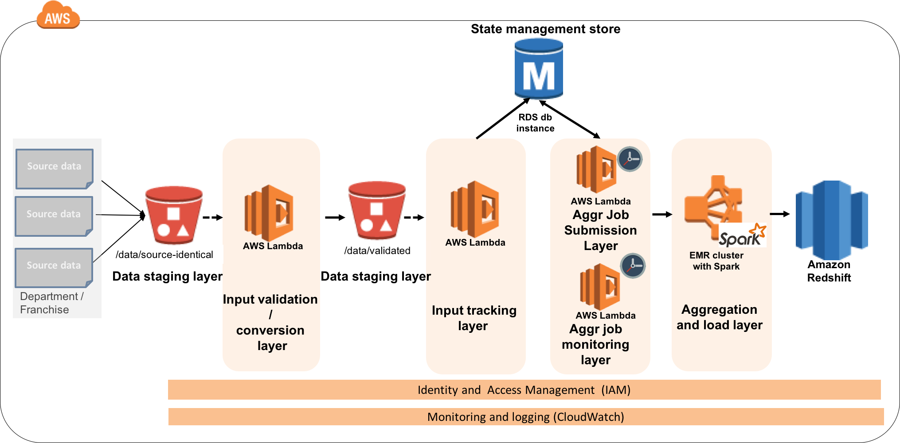

# Building Event Driven Batch Analytics on AWS

## Overview

This repository contains the code that supports the [AWS Big Data Blog Post](https://blogs.aws.amazon.com/bigdata/)

### Usecase Description
Yummy Foods, a hypothetical customer, has franchise stores all over the country. These franchise stores run on heterogeneous platforms and they submit cumulative transaction files to Yummy Foods corporate at various cadence levels throughout the day in tab delimited .tdf format. Due to a limitation in some of their systems, some franchise stores occasionally send additional data starting with characters such as “----“.

Yummy Foods needs to be able to update internal users on sales made by each franchise for a given item throughout the day, and as soon as the complete list of franchise files from a given province are available. The number of franchises per province is fixed and seldom changes.

The aggregation job for given province should not be submitted until the configured number of franchise store files from that province are available and also until the product master data update is posted at the beginning of the day. A master data update is identified by the presence of at least one “Item.csv” file for that day

Multiple transaction categories indicating whether credit card or cash has been used, whether its a drive through or in-store purchase, the actual sale amount, the actual tax amount etc. exists in each transaction file franchise store sends. The  aggregation job in our hypothetical should consider only records category: 4 (sale amount), 5 (tax amount) and 6 (discount amount). Once the aggregation job is completed only one record should exist for a combination of franchise store,item and transaction date

### Architecture



* The “Input Validation/ Conversion “ layer eliminates any bad data in the input files and converts the tab delimited .tdf files to .csv files.

* The “State Management Store” is modeled to be able to store ingested file status (INGESTEDFILESTATUS) and also the job configurations (AGGRJOBCONFIGURATION) with preconditions such as waiting until all the fixed number of vendor files are received for a province and verifying that the item master data is posted.  

* The “Input Tracking” layer records the last validated timestamp of the input file in the file status table (INGESTEDFILESTATUS) within the “State Management Store”.

* The “Aggregation Job Submission” layer submits a job when the preconditions configured for a job in the “State Management Store” are satisfied.

* The “Aggregation and Load layer” EMR Spark job, based on the input parameter, processes and aggregates the vendor transaction data and updates the Amazon Redshift data warehouse.

* The “Aggregation Job Monitoring” layer at a scheduled interval updates the active “Running” job status to either “Completed” or “Failed” for tracking purposes.


### Pre-Requisites
1. To organize your Lambda functions in your own VPC, the following pre-requisites need to be met:
  1. Create VPC with at least one private "MyPrivateSubnet" and one public subnet "MyPublicSubnet"
  2. Create a NAT Gateway or NAT Instance for [lambda functions in private subnet](https://aws.amazon.com/blogs/aws/new-access-resources-in-a-vpc-from-your-lambda-functions/) to be able to access internet
  3. Create a role "myLambdaRole" with AWSLambdaVPCAccessExecution, AWSLambdaRole, ElasticMapReduceForEC2Role,S3 and CloudWatch access policies
  4. Create security group "MySecurityGroup" with inbound MySQL (3306) and Redshift (5439) ports open.
2. Download MySQL JDBC driver (5.1.38 or later) and Redshift JDBC Driver (1.1.13 or later) and [add](https://maven.apache.org/guides/mini/guide-3rd-party-jars-local.html) those to your maven repository

### Getting Started

1. Create S3 bucket. This is the bucket where you would maintain data and configurations for testing the sample implementation provided here

 ```
  aws s3 mb <<S3_EDBA_BUCKET>>
  ```
2. Create  [Amazon RDS Mysql 5.7.x instance](http://docs.aws.amazon.com/AmazonRDS/latest/UserGuide/CHAP_GettingStarted.CreatingConnecting.MySQL.html)
3. Update [lambda function properties](src/main/resources/edba_lambda_config.properties) with your MySQL endpoint, username and password
4. Create EMR cluster with tag "edba=true". When submitting aggregation jobs to the cluster the "Aggregation Job Submission” layer lambda function will look for the active clusters that have this tag. If you wish to use to a different tag, update [lambda function properties](src/main/resources/edba_lambda_config.properties) to reflect the same. If you plan to use an existing cluster with similar configuration below, just [add the tag](http://docs.aws.amazon.com/ElasticMapReduce/latest/DeveloperGuide/emr-plan-tags-add.html) "edba=true"

  ```
    aws emr create-cluster --name “MY_EDBA_CLUSTER" --release-label emr-5.0.0 --use-default-roles --ec2-attributes KeyName=my-key --applications Name=Hadoop Name=Spark --region my-region --instance-groups InstanceGroupType=MASTER,InstanceCount=1,InstanceType=m3.xlarge InstanceGroupType=CORE,InstanceCount=3,InstanceType=m3.xlarge  --tags edba=true
  ```
5. Update [job configurations](resources/edba_config_mysql.sql) maintained in state management store with the S3 bucket name you created in step#1 and connect to the mysql database instance through your preferred SQL client to execute sql statements inside resources/edba_config_mysql.sql
6. Create a two node dc1.large [Redshift cluster](http://docs.aws.amazon.com/redshift/latest/mgmt/managing-clusters-console.html#create-cluster)
7. Connect to the cluster through your preferred SQL client and execute statements inside resources/edba_redshift.sql file
8. Update Update [spark job properties](src/main/resources/spark-job.conf) with Redshift cluster endpoint and S3 temporary path
9. Build the jar by executing maven shade package. You need to execute this command from the directory where the pom.xml is located

  ```
  mvn package
  ```
10. copy the final jar to s3 location you configured in step#3

  ```
  aws s3 cp ./eventdrivenbatchanalytics.jar s3://<<S3_EDBA_BUCKET>>/code/
  ```
11. Create Validation/Conversion Layer Lambda function

  ```
  aws lambda create-function --function-name validateAndNormalizeInputData --zip-file fileb:///<<MyPath>>/eventdrivenbatchanalytics.jar --handler com.amazonaws.bigdatablog.edba.LambdaContainer::validateAndNormalizeInputData --role arn:aws:iam::<<myAccountNumber>>:role/<<myLambdaRole>> --runtime java8 --timeout 120
  ```
12. Provide S3 permissions to invoke the Validation Layer lambda function

  ```
  aws lambda add-permission --function-name auditValidatedFile --statement-id 2222 --action "lambda:InvokeFunction" --principal s3.amazonaws.com --source-arn arn:aws:s3:::event-driven-batch-analytics --source-account <<MyAccount>>
  ```
13. Create "Input Tracking Layer" lambda function

  ```
  aws lambda create-function --function-name  auditValidatedFile --zip-file fileb:///<<MyPath>>/eventdrivenbatchanalytics.jar --handler com.amazonaws.bigdatablog.edba.LambdaContainer::auditValidatedFile --role arn:aws:iam::<<myAccountNumber>>:role/lambdas3eventprocessor --runtime java8 --vpc-config '{"SubnetIds":["MyPrivateSubnet"],"SecurityGroupIds":["MySecurityGroup"]}' --memory-size 1024 --timeout 120
  ```
14. Provide S3 permissions to invoke "Input Tracking Layer" lambda function

  ```
  aws lambda add-permission --function-name auditValidatedFile --statement-id 2222 --action "lambda:InvokeFunction" --principal s3.amazonaws.com --source-arn arn:aws:s3:::event-driven-batch-analytics --source-account 203726645967
  ```
15. Configure events in S3 to trigger "Validation/Conversion Layer" and "Input Tracking Layer" lambda functions

  ```
  aws s3api put-bucket-notification-configuration --notification-configuration file:///<<MyPath>>/put-bucket-notification.json --bucket event-driven-batch-analytics
  ```
16. Create EMR Job Submission Layer lambda function. This function will submit a EMR job if the respective configured  criteria has been passed  

  ```
  aws lambda create-function --function-name  checkCriteriaFireEMR --zip-file fileb:///<<MyPath>>/eventdrivenbatchanalytics.jar --handler com.amazonaws.bigdatablog.edba.LambdaContainer::checkConditionStatusAndFireEMRStep --role arn:aws:iam::<<myAccountNumber>>:role/lambdas3eventprocessor --runtime java8 \
  --vpc-config '{"SubnetIds":["MyPrivateSubnet"],"SecurityGroupIds":["MySecurityGroup"]}' --memory-size 1024 --timeout 300
  ```
17. Schedule CloudWatch Event to fire every 10 minutes to verify whether any Aggregation Job submission criteria is passed

  ```
  aws events put-rule --name scheduledEMRJobRule --schedule-expression 'rate(10 minutes)'
  ```
18. Give CloudWatch events rule permission to invoke "scheduledEMRJobRule" lambda function

  ```
  aws lambda add-permission \
  --function-name checkCriteriaFireEMR \
  --statement-id checkCriteriaFireEMR \
  --action 'lambda:InvokeFunction' \
  --principal events.amazonaws.com --source-arn  arn:aws:events:us-east-1:<<myAccountNumber>>:rule/scheduledEMRRule
  ```
19. Configure "checkCriteriaFireEMR" Lambda function as target for the "scheduledEMRJobRule" CloudWatch event rule

  ```
  aws events put-targets --rule scheduledEMRJobRule  --targets '{"Id" : "1", "Arn": "arn:aws:lambda:us-east-1:<<myAccountNumber>>:function:checkCriteriaFireEMR"}'
  ```
20. Create EMR Job Monitoring Layer lambda function. This function will update AGGRJOBCONFIGURATION table with status of a RUNNING EMR step

  ```
  aws lambda create-function --function-name  monitorEMRAggregationJob --zip-file fileb:///<<MyPath>>/eventdrivenbatchanalytics.jar --handler com.amazonaws.bigdatablog.edba.LambdaContainer::monitorEMRStep --role arn:aws:iam::<<myAccountNumber>>:role/lambdas3eventprocessor --runtime java8 \
  --vpc-config '{"SubnetIds":["MyPrivateSubnet"],"SecurityGroupIds":["MySecurityGroup"]}' --memory-size 500 --timeout 300
  ```
21. Schedule CloudWatch Event to monitor submitted EMR jobs  every 15 minutes

  ```
  aws events put-rule --name monitorEMRJobRule --schedule-expression 'rate(15 minutes)'
  ```
22. Give CloudWatch event rule permission to invoke "monitorEMRAggregationJob" lambda function

  ```
  aws lambda add-permission \
  --function-name monitorEMRAggregationJob \
  --statement-id monitorEMRAggregationJob \
  --action 'lambda:InvokeFunction' \
  --principal events.amazonaws.com --source-arn  arn:aws:events:us-east-1:<<myAccountNumber>>:rule/monitorEMRJobRule
  ```
23. Configure "monitorEMRAggregationJob" lambda function as target for "monitorEMRJobRule"

  ```
  aws events put-targets --rule monitorEMRJobRule  --targets '{"Id" : "1", "Arn": "arn:aws:lambda:us-east-1:<<myAccountNumber>>:function:monitorEMRAggregationJob"}'
  ```
24. Download the files from resources/sampledata/ to your local directory and from the directory where you downloaded the files to, upload them to S3://event-driven-batch-analytics/ with prefix data/source-identical.

  ```
  aws s3 sync . s3://<<S3_EDBA_BUCKET>>/data/source-identical/
  ```
25. Observe the timestamps of CloudWatch logs for each of the lambda functions being created and updated. Notice that there are no errors recorded
21) After around 10 minutes, connect to the MySQL client and verify whether any jobs have been submitted. The schedule interval will determine the delay

  ```
  select job_config_id from aggrjobconfiguration where last_exec_status = 'RUNNING';
  ```
26. Verify that the job configuration "J101" (Vendor transactions posted from the state of "Illinois") is in "RUNNING" state

27. Connect to the redshift cluster and verify that the data in the tables "vendortranssummary" is populated for the vendor transactions.

28. If for any reason a job is failed, execute the below query to find out the impacted files

  ```
  select t1.job_config_id,t2.file_url,t2.last_validated_timestamp from aggrjobconfiguration t1 join ingestedfilestatus t2 on json_contains(t2.submitted_jobs,json_array(t1.job_config_id))=1 where t1.last_exec_status='FAILED';
  ```
